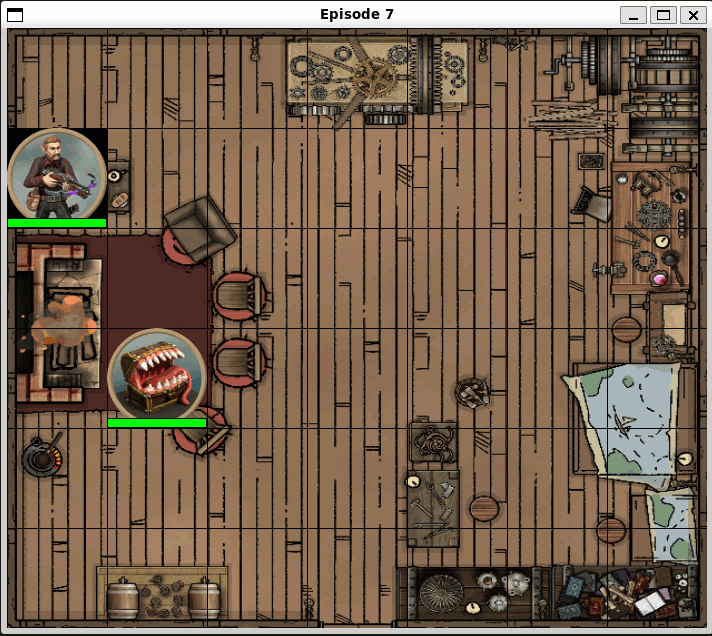

# D&D Combat with Reinforcement Learning

This repository contains a project focused on applying reinforcement learning techniques to simulate combat scenarios in Dungeons&Dragons, unsing Q-learning and DQN.

## Overview

The project aims to create an intelligent agent that can learn to defeat an enemy in a D&D combat. By leveraging reinforcement learning algorithms, the agents can make decisions to maximize their chances of success in battles.

<p align="center">
  
</p>

*Credits of background picture [here](https://www.reddit.com/r/battlemaps/comments/q6ncj9/9x9630x630buildingbattlemap_freds_shed_cosy/)*

## Features

- **agent_interfaces/**: Defines the interfaces for different types of agents used in the simulation.
- **algorithms/**: Contains the implementation of various reinforcement learning algorithms, including Q-learning and DQN.
- **combat_actions/**: Defines the different actions that agents can perform during combat.
- **statistics/**: Collects and visualizes data on agents performance and learning progress. Here are located the results of each test and the notebook associated.
- **Agent**: Defines the agents classes.
- **config.yml**: Contains the configuration and hyperparameters of the entire simulation.
- **DnDEnvironment**: Simulates the D&D combat environment where agents interact.
- **main**: Contains the core of the program logic. Here are located the main loop of episodes and the step function.
- **State**: Represents the state of the simulation.

## Usage

Run the main script to start the simulation:

```bash
python main.py
```
