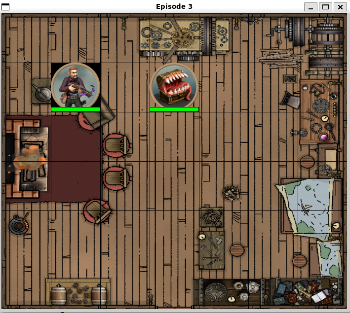

# D&D Combat with Reinforcement Learning

This repository contains a project focused on applying reinforcement learning techniques to simulate combat scenarios in Dungeons&Dragons, unsing Q-learning and DQN.

## Overview

The project aims to create an intelligent agent that can learn to defeat an enemy in a D&D combat. By leveraging reinforcement learning algorithms, the agents can make decisions to maximize their chances of success in battles.

<p align="center">
  
</p>

## Features

- **Agent Interfaces**: Defines the interfaces for different types of agents used in the simulation.
- **Algorithms**: Contains the implementation of various reinforcement learning algorithms, including Q-learning and DQN.
- **Combat Actions**: Manages the different actions that agents can perform during combat.
- **Environment**: Simulates the DnD combat environment where agents interact and learn.
- **Statistics**: Collects and visualizes data on agent performance and learning progress.

## Usage

Run the main script to start the simulation:

```bash
python main.py
```
